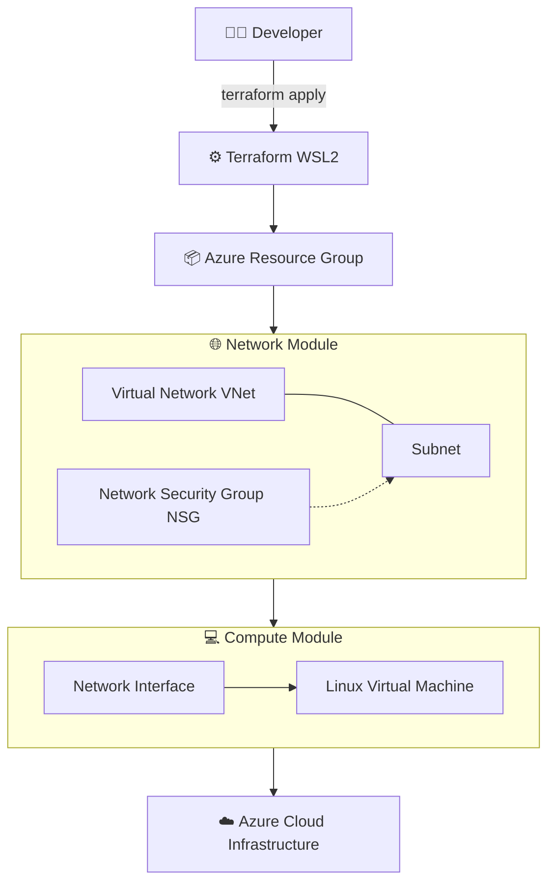

```markdown
# DevOps Lab — Azure + Terraform Engineering Portfolio

Enterprise-grade DevOps and Infrastructure-as-Code (IaC) learning repository built to simulate real-world cloud engineering workflows using Microsoft Azure and Terraform.

This project demonstrates practical skills in:
- Cloud infrastructure design
- Infrastructure-as-Code (Terraform)
- Modular architecture (network + compute separation)
- CI/CD automation
- DevOps engineering practices
- Security-first cloud architecture

> ⚠️ Status: Active learning + production-style portfolio build

---

# 🧠 Engineering Objective

This repository simulates how real DevOps engineers design, build, and manage cloud infrastructure in enterprise environments.

Focus areas:
- Reusable Infrastructure-as-Code (IaC)
- Modular Azure architecture
- Secure cloud deployments
- Automated CI/CD pipelines
- Production-ready Terraform patterns
- State-driven infrastructure lifecycle

---

# 🧰 Technology Stack

- Microsoft Azure (Cloud Platform)
- Terraform (Infrastructure-as-Code)
- Ubuntu (WSL2 Development Environment)
- Git & GitHub (Version Control)
- GitHub Actions (CI/CD Automation)
- Bash Scripting (Automation)
- YAML (Pipeline Definitions)

---

# 🏗️ Current Architecture (Implemented)



---

# 📁 Repository Structure

```
📁 devops-lab/
│
├── 📁 docs/
│   ├── 📁 terraform/
│   ├── 📁 azure/
│   ├── 📁 devops/
│   └── 📁 architecture/
│
├── 📁 terraform/
│   ├── 📁 environments/
│   │   ├── 📁 dev/
│   │   ├── 📁 staging/
│   │   └── 📁 prod/
│   │
│   ├── 📁 modules/
│   │   ├── 📁 network/
│   │   ├── 📁 compute/
│   │   ├── 📁 storage-account/
│   │   ├── 📁 keyvault/
│   │   └── 📁 monitoring/
│   │
│   ├── 📁 scripts/
│   └── 📁 tests/
│
├── 📁 .github/
│   └── 📁 workflows/
│
├── 📄 .gitignore
└── 📄 README.md
```

---

# 📚 Documentation Index

## Terraform Knowledge Base
- terraform-best-practices.md
- terraform-modules.md
- terraform-remote-state.md
- terraform-security.md
- terraform-setup-wsl-azure.md
- terraform-state-management.md
- terraform-testing.md
- terraform-workspaces.md

---

## Azure Architecture
- azure-networking.md
- azure-storage.md
- azure-rbac.md
- azure-security.md

---

## DevOps & CI/CD
- github-actions.md
- azure-devops-pipelines.md
- git-workflow.md
- testing-strategy.md

---

# 🚀 Current Engineering Progress

✔ WSL2 DevOps environment configured  
✔ Azure CLI authenticated  
✔ Terraform installed and validated  
✔ Remote backend configured (Azure Storage)  
✔ Modular architecture implemented (network + compute)  
✔ First VM successfully deployed  
✔ SSH access working  
✔ Infrastructure state management validated  
✔ CI/CD structure initiated  

---

# 🎯 Engineering Roadmap

## 🧱 Infrastructure-as-Code (Terraform)
- Build reusable enterprise modules  
- Expand compute module (VM hardening)  
- Multi-environment strategy (dev/staging/prod)  
- Automated testing & validation pipelines  
- Policy-as-code (governance layer)  

---

## ☁️ Azure Cloud Architecture
- VNet segmentation (hub-spoke design)  
- VM scale sets (VMSS)  
- Azure Key Vault integration  
- RBAC + least privilege enforcement  

---

## ⚙️ DevOps Automation
- GitHub Actions CI/CD pipeline  
- Terraform plan on PR / apply on merge  
- Security scanning (tfsec / checkov)  
- Infrastructure drift detection  

---

# 🔐 Security & Governance Focus

- No hardcoded secrets in code  
- Secure remote state storage (Azure Storage)  
- Role-Based Access Control (RBAC)  
- Secure CI/CD pipeline design  
- SSH-only VM authentication  

---

# 📈 Long-Term Vision

This project evolves toward:
- Production-grade Terraform platform  
- Enterprise DevOps automation system  
- Multi-environment cloud infrastructure  
- Reusable infrastructure modules  
- Secure cloud governance model  
- Portfolio-ready engineering showcase  

---

# 🧠 Core Skills Demonstrated

- Infrastructure-as-Code (Terraform)  
- Azure Cloud Engineering  
- Modular architecture design  
- DevOps automation workflows  
- CI/CD pipeline concepts  
- Networking & cloud architecture  
- Secure infrastructure design  
- Git-based collaboration workflows  

---

# 💼 Portfolio Positioning

This repository demonstrates the ability to:

✔ Design scalable cloud infrastructure  
✔ Build reusable Terraform modules  
✔ Automate deployments using DevOps practices  
✔ Operate within Azure cloud environments  
✔ Implement modular, production-style IaC design  

---

# 📌 Status

> Actively evolving DevOps engineering portfolio focused on real-world cloud architecture, automation, and infrastructure design.
```

