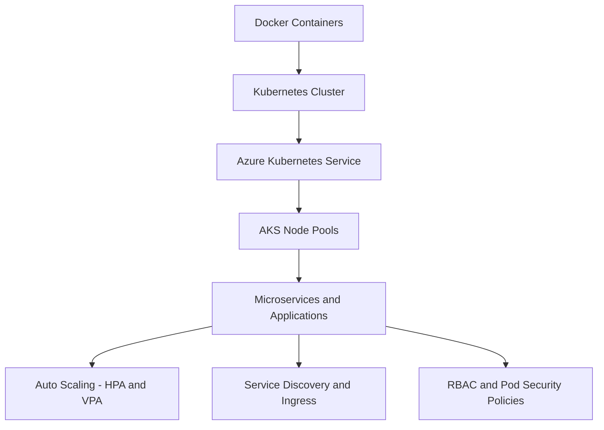

# DevOps Lab — Enterprise Multi-Cloud Infrastructure Platform

A production-style Infrastructure-as-Code (IaC) and DevOps engineering platform designed to simulate real enterprise cloud systems using Microsoft Azure, Terraform, Docker, Kubernetes, and AKS.

This project is built as a **cloud-agnostic infrastructure platform**, where Azure is the current implementation layer, but the architecture is designed to extend into AWS, GCP, and Kubernetes-native environments.

It demonstrates how modern infrastructure systems are:
- Designed (architecture layer)
- Built (Terraform + containerization layer)
- Secured (Zero Trust + RBAC)
- Delivered (CI/CD pipelines)
- Operated (state, monitoring, drift control)
- Scaled (Kubernetes + AKS layer)
- Extended (multi-cloud abstraction layer)
---

---

# 🌐 Multi-Cloud Design Model

This system is intentionally designed as a **portable infrastructure architecture**.

| Layer      | Azure         | AWS             | GCP                  |
| ---------- | ------------- | --------------- | -------------------- |
| Network    | VNet          | VPC             | VPC Network          |
| Compute    | VM / AKS      | EC2 / EKS       | Compute Engine / GKE |
| Containers | AKS           | EKS             | GKE                  |
| Registry   | ACR           | ECR             | Artifact Registry    |
| Secrets    | Key Vault     | Secrets Manager | Secret Manager       |
| State      | Azure Storage | S3 + DynamoDB   | GCS + Firestore      |

This enables the system to evolve into a **true multi-cloud + Kubernetes-native platform engineering stack**.

---

# 🐳 Container & Kubernetes Layer

This project extends beyond infrastructure into **containerized workload orchestration**.

## Docker Layer

* Application packaging using Docker images
* Immutable runtime environments
* Portable build artifacts

## Kubernetes Layer

* Container orchestration using Kubernetes
* Declarative deployment model
* Service abstraction + scaling
* Self-healing workloads

## AKS (Azure Kubernetes Service)

* Managed Kubernetes control plane
* Integrated Azure networking
* IAM + RBAC integration
* Production-grade cluster management

---

# ✅ Completed Features (Implemented System Capabilities)

✓ WSL2-based DevOps development environment configured
✓ Azure CLI authentication and Terraform toolchain validated
✓ Modular Azure infrastructure implemented (network, Key Vault, compute)
✓ Remote Terraform state stored in Azure Blob Storage with Azure AD / OIDC authentication
✓ GitHub Actions CI/CD pipelines implemented for Terraform delivery
✓ Validation chain implemented (terraform fmt, terraform validate, Checkov, TFLint)
✓ Private Linux VM deployed with no public IP exposure
✓ Azure Bastion access path working for private VM administration
✓ Azure Key Vault deployed for secret storage and SSH key handling
✓ RBAC-based Key Vault access enabled
✓ Key Vault firewall and purge protection enabled
✓ CI-specific Terraform tfvars flow added for reproducible pipeline runs
✓ Pipeline hardening completed with action pinning and explicit runtime settings
✓ Multi-cloud abstraction model introduced (Azure / AWS / GCP mapping)

---

# 🧠 Engineering Objective

This platform simulates enterprise-grade cloud systems with **multi-layer architecture design**:

Core focus areas:

* Infrastructure-as-Code (Terraform)
* Containerization (Docker)
* Container orchestration (Kubernetes)
* Managed Kubernetes (AKS)
* Cloud-agnostic architecture design
* Secure cloud systems (Zero Trust model)
* CI/CD automation pipelines
* Multi-environment deployment strategy

---

# 🧰 Technology Stack

Microsoft Azure (Primary cloud)
Terraform (Infrastructure-as-Code engine)
Docker (Containerization layer)
Kubernetes (Orchestration layer)
AKS (Managed Kubernetes service)
GitHub Actions (CI/CD automation)
Ubuntu WSL2 (Development environment)
Azure CLI (Cloud interface)
Bash (Automation scripting)
YAML (Pipeline definitions)

---

# 🎯 Engineering Roadmap

## Infrastructure-as-Code (Multi-Cloud Expansion)

* Extend Terraform modules to support AWS and GCP providers
* Introduce Kubernetes-native infrastructure provisioning
* Add Helm chart automation layer
* Implement GitOps-based deployment model (ArgoCD / Flux)

## Container Platform Evolution

* Full microservices deployment on AKS
* Docker image CI/CD pipeline integration
* Kubernetes autoscaling policies (HPA / VPA)
* Service mesh integration (Istio / Linkerd)

## Azure Cloud Architecture

* Hub-and-spoke networking topology
* VM Scale Sets (VMSS)
* Private DNS zone integration
* Managed identity expansion

## DevOps Automation

* PR-based Terraform plan comment system
* Drift detection pipelines (multi-cloud validation)
* Production approval gates
* Cross-cloud deployment abstraction layer

---

# 🔐 Security Architecture

* No hardcoded secrets in codebase
* Azure Key Vault for secret storage
* RBAC-based identity model
* Private VM and AKS node isolation
* Bastion-based administrative access
* OIDC-based GitHub authentication for CI/CD
* Encrypted Terraform remote state backend

---

# 📈 FinOps & Cost Design

* Modular infrastructure enables selective provisioning
* Environment-based deployments (dev/staging/prod)
* Kubernetes-based scaling reduces overprovisioning
* State-driven lifecycle prevents duplication
* Full destroy/recreate capability via Terraform

---

# 🧠 Core Engineering Skills Demonstrated

* Infrastructure-as-Code (Terraform)
* Docker containerization
* Kubernetes orchestration
* AKS managed Kubernetes operations
* Multi-cloud architecture design
* Azure Cloud Engineering
* DevOps CI/CD system design
* Secure system design (Zero Trust)
* Modular distributed architecture
* GitOps-style delivery workflows
* Cloud governance and cost optimization

---

# 🚀 Project Status

This system is fully operational as a production-style **multi-cloud + Kubernetes-ready Azure DevOps platform**.

It demonstrates real-world cloud engineering practices including secure infrastructure design, containerized workloads, Kubernetes orchestration, and modular system architecture that can scale across Azure, AWS, and GCP.

