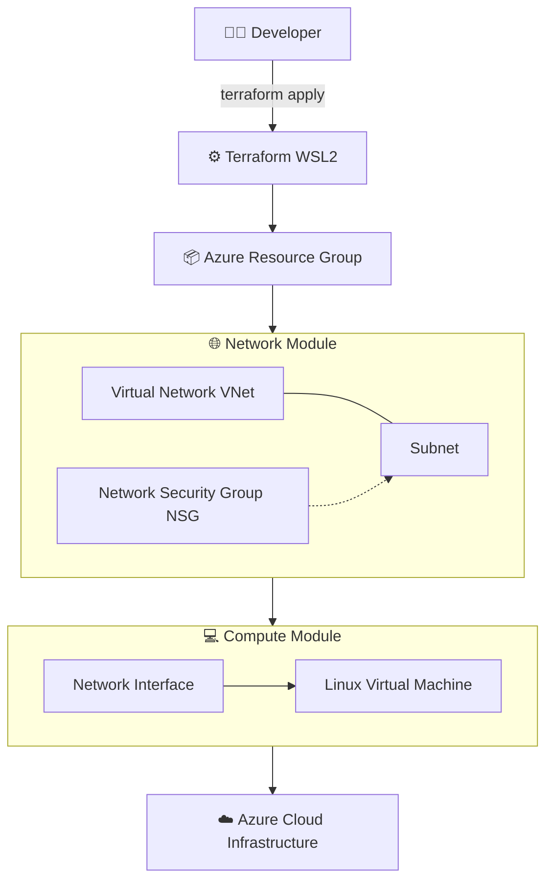

```markdown
# DevOps Lab — Azure + Terraform Engineering Portfolio

Enterprise-grade DevOps and Infrastructure-as-Code (IaC) learning repository built to simulate real-world cloud engineering workflows using Microsoft Azure and Terraform.

This project demonstrates practical skills in:
- Cloud infrastructure design
- Infrastructure-as-Code (Terraform)
- Modular architecture (network + compute separation)
- CI/CD automation
- DevOps engineering practices
- Security-first cloud architecture

> ✅ Status: Core platform features completed; documentation and future enhancements continue

---

# 🧠 Engineering Objective

This repository simulates how real DevOps engineers design, build, and manage cloud infrastructure in enterprise environments.

Focus areas:
- Reusable Infrastructure-as-Code (IaC)
- Modular Azure architecture
- Secure cloud deployments
- Automated CI/CD pipelines
- Production-ready Terraform patterns
- State-driven infrastructure lifecycle

This project follows production-style Infrastructure-as-Code practices used in enterprise Azure DevOps environments.

---

# 🧰 Technology Stack

- Microsoft Azure (Cloud Platform)
- Terraform (Infrastructure-as-Code)
- Ubuntu (WSL2 Development Environment)
- Git & GitHub (Version Control)
- GitHub Actions (CI/CD Automation)
- Bash Scripting (Automation)
- YAML (Pipeline Definitions)

---

# 🏗️ Current Architecture (Implemented)



---

# 📁 Repository Structure

```
📁 devops-lab/
│
├── 📁 docs/
│   ├── 📁 terraform/
│   ├── 📁 azure/
│   ├── 📁 devops/
│   └── 📁 architecture/
│
├── 📁 terraform/
│   ├── 📁 environments/
│   │   ├── 📁 dev/
│   │   ├── 📁 staging/
│   │   └── 📁 prod/
│   │
│   ├── 📁 modules/
│   │   ├── 📁 network/
│   │   ├── 📁 compute/
│   │   ├── 📁 storage-account/
│   │   ├── 📁 keyvault/
│   │   └── 📁 monitoring/
│   │
│   ├── 📁 scripts/
│   └── 📁 tests/
│
├── 📁 .github/
│   └── 📁 workflows/
│
├── 📄 .gitignore
└── 📄 README.md
```

---

# 📚 Documentation Index

## Terraform Knowledge Base

* terraform-best-practices.md
* terraform-modules.md
* terraform-remote-state.md
* terraform-security.md
* terraform-setup-wsl-azure.md
* terraform-state-management.md
* terraform-testing.md
* terraform-workspaces.md

---

## Azure Architecture

* azure-networking.md
* azure-storage.md
* azure-rbac.md
* azure-security.md

---

## DevOps & CI/CD

* github-actions.md
* azure-devops-pipelines.md
* pipeline-trigger-cheat-sheet.md
* git-workflow.md
* testing-strategy.md

---

## Completed Features

The following capabilities are implemented and working in this repository:

- [x] WSL2-based DevOps development environment configured  
- [x] Azure CLI authentication and Terraform toolchain validated  
- [x] Modular Azure infrastructure implemented (network, Key Vault, compute)  
- [x] Remote Terraform state stored in Azure Blob Storage with Azure AD / OIDC auth  
- [x] GitHub Actions plan/apply workflows implemented for Terraform delivery  
- [x] Validation chain implemented (terraform fmt, terraform validate, Checkov, TFLint)  
- [x] Private Linux VM deployed with no public IP exposure  
- [x] Azure Bastion access path working for private VM administration  
- [x] Azure Key Vault deployed for secret storage and SSH key handling  
- [x] RBAC-based Key Vault access enabled  
- [x] Key Vault firewall and purge protection enabled  
- [x] CI-specific Terraform tfvars flow added for reproducible pipeline runs  
- [x] Pipeline hardening completed with action pinning and explicit runtime settings  
- [x] Comprehensive pipeline documentation added (docs/devops/azure-devops-pipelines.md)  
- [x] Multi-cloud access contract baseline added (Azure / AWS / GCP mapping)

---

# 🎯 Engineering Roadmap

## 🧱 Infrastructure-as-Code (Terraform)

* Expand reusable module coverage for storage/monitoring/resource-group
* Add private endpoint pattern for Key Vault + private DNS integration
* Strengthen VM hardening baseline (updates, diagnostics, policy checks)
* Extend environment strategy (dev/test/prod parity checks)
* Add policy-as-code enforcement gates (OPA/Checkov policy bundles)

---

## ☁️ Azure Cloud Architecture

* VNet segmentation (hub-spoke design)
* VM scale sets (VMSS)
* Key Vault private endpoint rollout (planned)
* Bastion subnet NSG hardening with validated Azure-required rules
* RBAC + least privilege enforcement

---

## ⚙️ DevOps Automation

* Promote current GitHub Actions plan/apply workflows to protected branch flow
* Add PR comments with Terraform plan summary and risk highlights
* Add scheduled drift detection workflow
* Add cloud matrix strategy for upcoming AWS/GCP environments

---

# 🔐 Security & Governance Focus

* No hardcoded secrets in code
* Secure remote state storage (Azure Storage)
* Role-Based Access Control (RBAC) for Key Vault
* Secure CI/CD pipeline design
* Bastion-only VM access with private networking

---

# 📈 Long-Term Vision

This project evolves toward:

* Production-grade Terraform platform
* Enterprise DevOps automation system
* Multi-environment cloud infrastructure
* Reusable infrastructure modules
* Secure cloud governance model
* Portfolio-ready engineering showcase

---

# 🧠 Core Skills Demonstrated

* Infrastructure-as-Code (Terraform)
* Azure Cloud Engineering
* Modular architecture design
* DevOps automation workflows
* CI/CD pipeline concepts
* Networking & cloud architecture
* Secure infrastructure design (RBAC model)
* Git-based collaboration workflows

---

# 💼 Portfolio Positioning

This repository demonstrates the ability to:

✔ Design scalable cloud infrastructure
✔ Build reusable Terraform modules
✔ Automate deployments using DevOps practices
✔ Operate within Azure cloud environments
✔ Implement modular, production-style IaC design

---

# 📌 Status

> The core Azure + Terraform platform is in place. The repository now serves as a working DevOps portfolio with completed infrastructure, security, and pipeline foundations, plus a roadmap for expansion.
```

