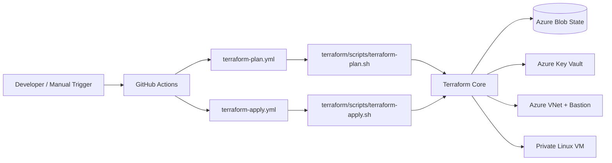

# Azure DevOps Pipelines for Terraform on Azure

This document explains the end-to-end pipeline implementation used in this repository for Terraform-based Azure provisioning. It covers the theory behind the design, the concrete implementation in code, the security model, and the operational flow used by the GitHub Actions workflows and Bash scripts.

The repository currently implements a GitHub Actions driven Terraform pipeline for the `dev` environment, with the same structure ready to be reused for `test` and `prod`.

## Goals

The pipeline is designed to:

- Provision Azure infrastructure safely and repeatably with Terraform.
- Separate plan and apply behavior.
- Authenticate to Azure without interactive logins.
- Keep Terraform state in Azure Storage with Azure AD/OIDC authorization.
- Store secrets in Azure Key Vault and prevent secret sprawl.
- Provide a secure network path to a private Linux VM through Azure Bastion.
- Validate, lint, and security-scan the Terraform code before deployment.
- Keep the workflow reproducible and easy to troubleshoot.

## High-Level Architecture

The implementation is split into three layers:

1. GitHub Actions workflows orchestrate the pipeline.
2. Bash scripts wrap Terraform commands and keep logic consistent across CI and local use.
3. Terraform modules define Azure resources in a reusable, least-privilege way.

## Repository Layout

The parts that matter for the pipeline are:

- [ .github/workflows/terraform-plan.yml ](.github/workflows/terraform-plan.yml)
- [ .github/workflows/terraform-apply.yml ](.github/workflows/terraform-apply.yml)
- [ terraform/scripts/terraform-plan.sh ](terraform/scripts/terraform-plan.sh)
- [ terraform/scripts/terraform-apply.sh ](terraform/scripts/terraform-apply.sh)
- [ terraform/tests/run-all.sh ](terraform/tests/run-all.sh)
- [ terraform/tests/validation/validate.sh ](terraform/tests/validation/validate.sh)
- [ terraform/tests/lint/run-tflint.sh ](terraform/tests/lint/run-tflint.sh)
- [ terraform/tests/security/run-checkov.sh ](terraform/tests/security/run-checkov.sh)
- [ terraform/environments/dev/main.tf ](terraform/environments/dev/main.tf)
- [ terraform/environments/dev/backend.tf ](terraform/environments/dev/backend.tf)
- [ terraform/environments/dev/providers.tf ](terraform/environments/dev/providers.tf)
- [ terraform/environments/dev/variables.tf ](terraform/environments/dev/variables.tf)
- [ terraform/environments/dev/ci.tfvars.json ](terraform/environments/dev/ci.tfvars.json)
- [ terraform/environments/dev/ssh_public_key.pub ](terraform/environments/dev/ssh_public_key.pub)
- [ terraform/modules/network/main.tf ](terraform/modules/network/main.tf)
- [ terraform/modules/keyvault/main.tf ](terraform/modules/keyvault/main.tf)
- [ terraform/modules/compute/main.tf ](terraform/modules/compute/main.tf)

## Workflow Strategy

### Plan Workflow

The plan workflow is defined in [terraform-plan.yml](.github/workflows/terraform-plan.yml). It runs on `pull_request` and only targets files under `terraform/**` plus the workflow file itself.

Its responsibilities are:

- Check out the repository.
- Install Terraform.
- Set up Python for Checkov.
- Install Checkov and TFLint.
- Make helper scripts executable.
- Run the full validation suite.
- Generate a Terraform plan artifact.

The plan workflow is intentionally opinionated: it treats code quality as part of the pipeline rather than as a separate manual step.

### Apply Workflow

The apply workflow is defined in [terraform-apply.yml](.github/workflows/terraform-apply.yml). It is intentionally manual and runs only on `workflow_dispatch`.

That choice matters:

- It prevents accidental production-like changes from being applied automatically.
- It keeps apply as an explicit operator action.
- It makes the pipeline a controlled release mechanism instead of a push-triggered side effect.

The apply workflow:

- Accepts `environment` and `cloud` inputs.
- Uses GitHub environment scoping for the selected environment.
- Exports Azure auth variables from GitHub Secrets.
- Runs validation before apply.
- Executes the apply script.

## Azure Authentication Model

The implementation uses Azure authentication through GitHub Actions environment variables and OIDC-aware backend configuration.

### Key Inputs

The pipeline exports these values into the Terraform runtime:

- `ARM_USE_OIDC=true`
- `ARM_CLIENT_ID`
- `ARM_CLIENT_SECRET`
- `ARM_SUBSCRIPTION_ID`
- `ARM_TENANT_ID`

The corresponding values are stored in GitHub Secrets:

- `AZURE_CLIENT_ID`
- `AZURE_CLIENT_SECRET`
- `AZURE_SUBSCRIPTION_ID`
- `AZURE_TENANT_ID`

### Why This Matters

This is the CI equivalent of a service principal-based identity model:

- The pipeline has a stable Azure identity to act as.
- Terraform can authenticate without a developer logging in interactively.
- Authorization can be limited by Azure RBAC and Key Vault RBAC.
- OIDC reduces dependency on static credentials in the long term.

### Service Principal vs OIDC

Conceptually, the pipeline uses a service principal identity, but the backend and provider are configured for OIDC/Azure AD authentication.

In practical terms:

- The application identity is represented by the client ID.
- Azure RBAC assignments determine what the pipeline can read or change.
- OIDC is used for safer non-interactive authentication.
- This reduces reliance on long-lived credentials, even though the workflow still exports the standard `ARM_*` variables.

## Terraform State and Backend

The backend is configured in [terraform/environments/dev/backend.tf](terraform/environments/dev/backend.tf) to use Azure Blob Storage:

- Resource group: `tfstate-rg`
- Storage account: `tfstate19257`
- Container: `terraform-state`
- Key: `dev.terraform.tfstate`

The backend uses:

- `use_oidc = true`
- `use_azuread_auth = true`

This means state is not stored locally in CI and is not committed to the repository.

### Why Remote State Is Important

Remote state provides:

- Concurrency control through state locking.
- Shared source of truth between developers and CI.
- Drift detection across runs.
- A clean separation between code and deployed infrastructure state.

## Azure Resources Provisioned

The `dev` environment is composed from three main modules plus a root-level secret resource.

### Resource Group

The root module creates the target resource group before any child module resources.

### Network Module

The network module creates:

- Virtual Network
- Application subnet
- AzureBastionSubnet
- Network Security Group
- Bastion public IP
- Azure Bastion host

Relevant code:

- [terraform/modules/network/main.tf](terraform/modules/network/main.tf)
- [terraform/modules/network/outputs.tf](terraform/modules/network/outputs.tf)

### Key Vault Module

The Key Vault module creates a vault with:

- RBAC authorization enabled
- Soft delete retention
- Purge protection
- Configurable firewall default action
- Optional IP allowlist

Relevant code:

- [terraform/modules/keyvault/main.tf](terraform/modules/keyvault/main.tf)
- [terraform/modules/keyvault/variables.tf](terraform/modules/keyvault/variables.tf)
- [terraform/modules/keyvault/outputs.tf](terraform/modules/keyvault/outputs.tf)

### Compute Module

The compute module creates a private Linux VM with:

- No public IP on the NIC
- Password authentication disabled
- SSH key authentication only
- Basic VM hardening through variable validation

Relevant code:

- [terraform/modules/compute/main.tf](terraform/modules/compute/main.tf)
- [terraform/modules/compute/variables.tf](terraform/modules/compute/variables.tf)
- [terraform/modules/compute/outputs.tf](terraform/modules/compute/outputs.tf)

## Security Design

Security is not a separate layer here; it is built into the infrastructure and the pipeline.

### 1. Azure Key Vault

The VM SSH public key is stored in Azure Key Vault as a secret rather than being passed around as a plain variable.

The root module writes the key with:

- [terraform/environments/dev/main.tf](terraform/environments/dev/main.tf)

The secret is created from:

- [terraform/environments/dev/ssh_public_key.pub](terraform/environments/dev/ssh_public_key.pub)

#### Why Key Vault Helps

- Centralized secret management.
- Access control through Azure RBAC.
- Auditability.
- Avoids scattering sensitive material through pipeline logs or repository variables.

#### Key Vault Firewall Model

The Key Vault module supports a configurable firewall mode:

- `Allow` for CI convenience and temporary reachability.
- `Deny` for stricter network restriction.

The dev environment currently uses `Allow` in [ci.tfvars.json](terraform/environments/dev/ci.tfvars.json), because hosted GitHub runners have dynamic IPs and can break static allowlists.

### 2. Azure Bastion

Azure Bastion gives secure remote access to the private VM without exposing the VM to the internet.

Benefits:

- No public IP on the VM NIC.
- SSH access through the Azure control plane.
- Reduced attack surface.
- Easier operator access for private workloads.

The Bastion implementation uses:

- A dedicated `AzureBastionSubnet`
- A Standard public IP for the Bastion host
- Standard Bastion SKU with tunneling enabled

### 3. Private VM Design

The VM is intentionally private:

- NIC is attached only to the application subnet.
- Public IP is explicitly nulled out.
- SSH is the only auth method.
- VM size is validated to begin with `Standard_`.
- Usernames like `root`, `admin`, and `administrator` are rejected.

### 4. Checkov and TFLint

The pipeline treats security and linting as first-class checks.

- Checkov scans Terraform for security misconfigurations.
- TFLint catches Terraform anti-patterns and provider-specific issues.

### 5. Checkov Exceptions

Security scanning often has to balance correctness with reality. The repo includes targeted `checkov` suppressions where a rule would otherwise reject a deliberate design choice, such as:

- Bastion subnet naming and service-managed behavior.
- Dev Key Vault exposure to support CI runner reachability.

## Terraform Environment Model

The implementation is environment-aware.

### Current Environment

The active environment is `dev`.

### Environment Inputs

The root variables in [terraform/environments/dev/variables.tf](terraform/environments/dev/variables.tf) define:

- Azure region
- Resource group name
- VNet name and address space
- Subnet name and address prefix
- NSG name
- VM name and size
- Admin username
- Key Vault firewall policy
- Tags

### CI-Specific Variables

CI uses [terraform/environments/dev/ci.tfvars.json](terraform/environments/dev/ci.tfvars.json) so Terraform can run without the ignored local `terraform.tfvars` file.

This is important because:

- `terraform.tfvars` is typically local and may be ignored.
- CI needs a tracked, reproducible configuration source.
- The same values can be used consistently across runs.

## Bash Script Design

The Bash scripts are the glue between GitHub Actions and Terraform.

### terraform-plan.sh

[terraform/scripts/terraform-plan.sh](terraform/scripts/terraform-plan.sh) does the following:

- Detects environment and cloud inputs.
- Validates that Terraform is installed.
- Resolves the environment directory.
- Builds backend config arguments from Azure environment variables.
- Runs `terraform fmt -check -recursive` on the Terraform tree.
- Runs `terraform init` with OIDC/Azure AD backend settings.
- Runs `terraform validate`.
- Selects `terraform.tfvars` or `ci.tfvars.json` automatically.
- Generates a saved plan file under `.plans/`.

#### Why It Matters

This script gives the plan workflow a single, explicit execution model. It prevents logic drift between CI and local usage and makes the plan result reproducible.

### terraform-apply.sh

[terraform/scripts/terraform-apply.sh](terraform/scripts/terraform-apply.sh) mirrors the plan script and adds apply behavior.

It does the following:

- Detects environment and cloud.
- Validates Terraform availability and environment directory existence.
- Builds backend config arguments.
- Runs `terraform init` with OIDC/Azure AD backend settings.
- Picks a variable file from `terraform.tfvars` or `ci.tfvars.json`.
- Applies a saved plan if one exists.
- Otherwise applies current configuration.
- In GitHub Actions, performs a bootstrap targeted apply for the Key Vault when needed so the runner can reach the vault before the full apply.

#### Why the Bootstrap Step Exists

Hosted GitHub runners can trigger access problems against a locked-down Key Vault. The bootstrap apply updates the vault settings first, which prevents the full apply from failing during state refresh of the SSH secret.

### Validation Script Chain

The full quality gate is driven by [terraform/tests/run-all.sh](terraform/tests/run-all.sh):

1. Validate Terraform configuration.
2. Run Checkov.
3. Run TFLint.

Supporting scripts:

- [terraform/tests/validation/validate.sh](terraform/tests/validation/validate.sh)
- [terraform/tests/security/run-checkov.sh](terraform/tests/security/run-checkov.sh)
- [terraform/tests/lint/run-tflint.sh](terraform/tests/lint/run-tflint.sh)

#### Why Split the Checks

Splitting these checks makes failures easier to interpret:

- Validation errors usually mean schema or syntax issues.
- Checkov findings usually mean security posture issues.
- TFLint findings usually mean style, provider, or Terraform correctness issues.

## Workflow Runtime Details

The workflows are tuned for GitHub-hosted runners.

### Node Runtime Handling

The workflows explicitly opt into Node 24 for JavaScript actions using `FORCE_JAVASCRIPT_ACTIONS_TO_NODE24=true`.

That reduces runtime drift and future-proofs the workflow as GitHub changes the default Node runtime for actions.

### Action Pinning

The current workflow pins all major GitHub Actions to immutable commit SHAs, including:

- checkout
- setup-terraform
- setup-python
- setup-tflint
- upload-artifact

This is a supply-chain hardening measure. It reduces the risk of action tag drift and makes the pipeline more reproducible.

## Operational Flow

### Plan Flow

1. A pull request is opened against Terraform-related files.
2. GitHub Actions starts the plan workflow.
3. The repo is checked out.
4. Terraform, Python, Checkov, and TFLint are installed.
5. Scripts are made executable.
6. The validation suite runs.
7. Terraform plan is generated and stored as an artifact.

### Apply Flow

1. An operator manually triggers the apply workflow.
2. The workflow selects the target environment and cloud label.
3. The repo is checked out.
4. Terraform is installed.
5. Validation runs before apply.
6. Terraform apply runs through the Bash wrapper.
7. Key Vault bootstrap logic runs if needed in CI.
8. Terraform applies the current configuration or a saved plan.

## Lessons Embedded in the Design

This implementation reflects several practical lessons:

- Key Vault firewall rules and hosted runners do not always mix well.
- Secret reads can fail before the configuration changes you want to make are applied.
- A private VM still needs an operator access path, and Bastion is cleaner than adding public SSH.
- CI should use tracked tfvars data rather than relying on ignored local files.
- Security scanning should be part of the normal pipeline rather than a separate afterthought.
- Pinned actions and explicit runtime settings make workflow behavior more predictable.

## Troubleshooting Guide

### Terraform init fails against the backend

Check:

- `ARM_TENANT_ID`
- `ARM_SUBSCRIPTION_ID`
- `ARM_CLIENT_ID`
- `ARM_USE_OIDC`
- Storage account RBAC permissions for the pipeline identity

### Terraform fails when reading the SSH secret

Check:

- Key Vault RBAC assignment for secrets access
- Key Vault network access policy
- Whether the GitHub runner IP is allowed when `default_action = "Deny"`

### VM SSH key parsing fails

Check:

- [terraform/environments/dev/ssh_public_key.pub](terraform/environments/dev/ssh_public_key.pub)
- Ensure the key is a single-line OpenSSH public key
- Ensure it has no accidental line wrapping or formatting artifacts

### Plan or apply cannot find tfvars

Check:

- `terraform.tfvars` may be local-only
- `ci.tfvars.json` should exist for CI
- The Bash scripts look for `terraform.tfvars` first, then `ci.tfvars.json`

### Lint or security gates fail

Check:

- TFLint plugin initialization
- Checkov suppressions and whether they match an intentional design decision
- Provider version compatibility

## Extending the Pipeline

The current design is easy to extend.

### Add Test and Prod

Use the same structure in:

- `terraform/environments/test`
- `terraform/environments/prod`

Keep the same module interface and vary only the environment-specific values.

### Add More Security Controls

Useful future additions include:

- Private endpoints for Key Vault and Storage
- Deny-by-default Key Vault in all non-CI environments
- Azure Policy assignments for guardrails
- Managed identities for workloads that need Azure access
- Secret rotation automation

### Add Observability

Possible enhancements:

- Diagnostic settings for Key Vault and Bastion
- Log Analytics workspace integration
- Activity log alerts for sensitive operations
- Terraform drift detection on a schedule

## Reference Summary

- Orchestration: GitHub Actions
- IaC tool: Terraform
- Cloud: Azure
- State backend: Azure Blob Storage with Azure AD/OIDC auth
- Secret store: Azure Key Vault
- Remote access: Azure Bastion
- Network isolation: Private VM subnet, no public VM IP
- Code quality: Terraform validate, Checkov, TFLint, fmt check
- Runtime: Bash wrappers with explicit backend and tfvars handling

## Closing Note

This pipeline is not just a deployment script. It is a small operating model for infrastructure delivery:

- GitHub Actions is the release control plane.
- Terraform is the declarative desired state.
- Azure Key Vault protects the secrets.
- Azure Bastion provides safe operator access.
- Bash scripts standardize execution.
- Security and validation are part of the normal path.

Together, these choices make the pipeline predictable, secure, and maintainable.
